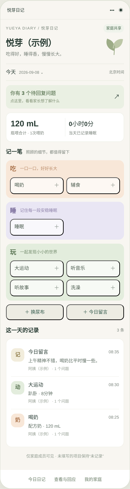
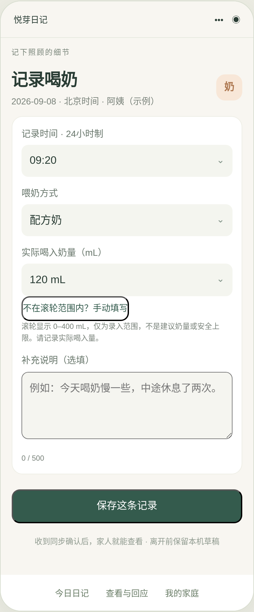
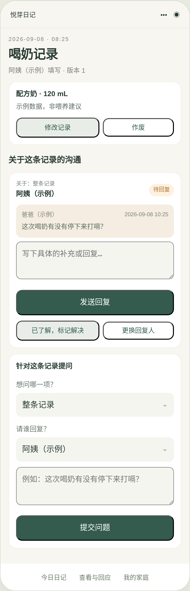

# 悦芽日记 (Yueya Diary)

A WeChat Mini Program designed for Chinese families to make daily childcare more visible, structured and easier to communicate between parents and hired childcare workers.

> The product itself is intentionally Chinese-only because it was designed specifically for families in the WeChat ecosystem and for a childcare scenario that is common in China.

[中文说明](README.zh-CN.md)

## Overview

Yueya Diary started from a real family problem.

As my wife was preparing to return to work after parental leave, one concern kept coming up:

> “When I am not there, how do I know what is actually happening with the baby?”

In many Chinese families, a 育儿嫂 is hired to assist with infant care. While this can solve the practical problem of childcare, it creates another one: parents want visibility into the baby's day, but they do not want every interaction with the caregiver to feel like supervision or confrontation.

Existing baby-tracking apps can record plenty of information, but they are often designed primarily for individual logging rather than structured parent–caregiver collaboration.

Yueya Diary was built around that gap.

The goal is not simply to collect more data. It is to reduce uncertainty.

## The Problem

Traditional communication between parents and caregivers often depends on fragmented WeChat messages, verbal updates, handwritten notes or memory.

That makes it difficult to answer simple questions later:

- How much milk did the baby drink today?
- How long did the baby sleep?
- What food was introduced?
- Was anything unusual?
- Why did a particular event happen?
- Has the baby's routine changed over time?

It also becomes harder when a family changes caregivers, because much of the previous childcare history disappears with the person who remembered it.

Yueya Diary turns these daily events into a structured, reviewable childcare record.

## Product Concept

The product separates the experience into two roles:

- parents;
- childcare workers.

Caregivers focus on quickly recording what happened during the day.

Parents focus on reviewing those records, understanding the baby's routine and asking questions when something needs clarification.

The intention is to create visibility without turning the product into an employee-monitoring system.

## Core Features

The first working version includes:

- milk feeding time and volume;
- solid food and allergy confirmation;
- sleep records;
- soothing and sleep methods;
- gross motor activities;
- bathing;
- music and listening activities;
- reading time, book title and pages;
- mood;
- body temperature;
- bowel movement colour and form;
- outdoor walks;
- diaper-change records;
- daily notes;
- date-based history review;
- parent and caregiver user roles;
- record-level parent questions and caregiver responses;
- support for family groups;
- cloud-based record storage;
- support for one or more caregivers;
- data export.

## Product Philosophy

The most important product insight is that this is not only a data-recording tool.

It is also an emotional product.

For a parent returning to work, the deeper problem is often not:

> “I need more childcare data.”

It is:

> “I cannot be there, so I do not know what is happening.”

Yueya Diary tries to reduce that uncertainty without requiring parents to constantly message the caregiver throughout the day.

A reliable record can sometimes provide reassurance without requiring continuous monitoring.

## Product Screenshots

### 1. Daily Dashboard



The home screen organises most daily activities into three simple categories: eating, sleeping and playing.

Diaper changes and daily notes remain available as separate quick actions.

The dashboard also gives parents a quick overview of feeding, sleep, unresolved questions and the chronological activity history for the day.

### 2. Feeding Record



The feeding workflow was designed around real childcare behaviour rather than using a generic form.

For example, milk volume is selected through structured values instead of arbitrary text entry.

The final digit is restricted to `0` or `5`, because bottle-feeding measurements such as 115 mL or 140 mL are realistic, while a value such as 113 mL usually implies precision that the bottle itself cannot provide.

The interface also prevents users from selecting a future time for an event that has not happened yet.

### 3. Parent–Caregiver Communication



One of the main differences between Yueya Diary and a standard baby-tracking application is the communication layer.

Parents can raise questions about an individual childcare record, and the caregiver can respond directly within the same context.

Instead of separating the discussion into another WeChat conversation, the question remains attached to the original event.

That makes the history easier to review and reduces ambiguity later.

## Key Product Decisions

### Structured around "Eat, Sleep, Play"

Instead of presenting caregivers with a long list of unrelated tracking functions, the first version groups most activities around three familiar parts of a baby's day:

Eat → Sleep → Play

This makes the main interface easier to understand and reduces the number of decisions required during routine use.

### Designed for realistic data entry

Inputs were designed around what a caregiver can realistically observe.

The feeding-volume example is one small illustration: the product avoids creating false precision simply because software makes arbitrary numbers possible.

### Preventing invalid records

Time validation prevents a caregiver from accidentally recording an event in the future.

This is a small constraint, but it improves data quality without adding extra work.

### Two different user roles

Parents and caregivers have different jobs inside the product.

The caregiver's experience prioritises fast recording.

The parent's experience prioritises review, questions and understanding what happened.

### Family-level privacy

The product is organised around a private family group.

A parent creates the group and invites selected family members and caregivers.

People outside the group cannot view that family's childcare records.

### Record-level communication

Questions stay attached to the relevant childcare event rather than becoming a separate generic conversation.

This preserves context and creates a clearer historical record.

## Product Flow

```mermaid
flowchart LR
    A[Caregiver records daily activity] --> B[Structured childcare data]
    B --> C[Parent reviews the day]
    C --> D[Questions and responses stay attached to records]
    D --> E[Lower uncertainty]
    E --> F[Long-term childcare history]
